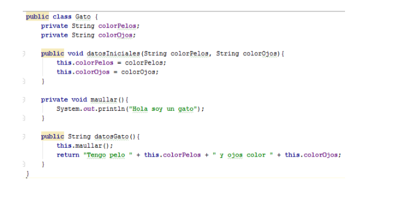
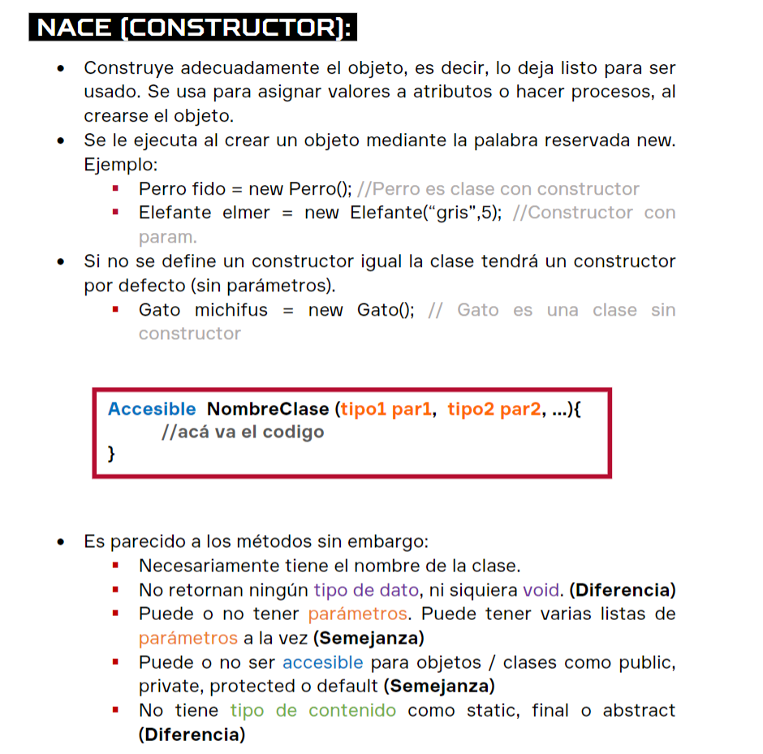
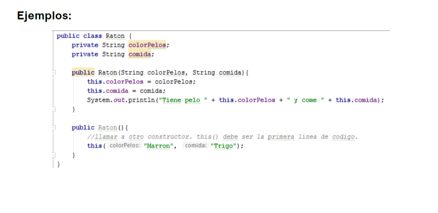

# Objetos en java

### Principios de las clases::
Toda clase tienen atributos (caracteristicas de algo) y metodos o funciones (acciones que realiza).
Para poder crearlas sería:
- para crear un objeto:
  - [tipo de dato][nombre de la varibale] = new [nombre de la clase]
    
```java
tipodato hola = new constructor();
```
- para poder usar los atributos y metodos sería:
  - todos están contenido en nuestro objeto
```java
objeto.metodo();
objeto.atributo();
```


Recordar palabras claves[^1].
:whale2:
:rabbit2:

| nombre de opción a usar| funcion  | example |
|:---:   |---: | ---|
|void      | Se usa cuando no se espera que se retorne nada |  public **void** setNombre( String nombre){   this.nombre=nombre;}
| | cuando no se pone nada en la clas, quiere decir que retornará un valor  | public string getNombre(){ **return** nombre;} |
|public| se puede acceder desde fuera de  la clase, el publico la puede ver|    |
|private| solo se puede acceder desde la misma clase donde se creo||
|protected| solo acceden clases de la misma carpeta (paquete)||
|


Se oscila tener una clase y que sus metodos esten en privado, para que así sea más seguro. por ello se usa get an set

```java
    public class persona {
    //definimos nuestros atributos- se recomienda que sean en privado

    private String nombre;
    private String apellido_materno;
    private String apellido_paterno;
    private String dni;
    private String edad;
    private String talla;
    private String peso;

    //creamos los get and set para que se pueda modificar nuestros atributos-
    //los get and set son metodos o funciones en java


    public String getNombre() {
        return nombre;
    }

    public void setNombre(String nombre) {
        this.nombre = nombre;
    }
```


## 1.Conceptos claves de Objetos
#### 1.1 Overload 
--> existen varios metodos con el mismo nombre, pero **se diferencian en los parametros que usan**. eexample:

    public class Perro { 
    void ladrar () {} 
    void ladrar (int volumen) {} 
    void ladrar (int volumen, int tonoAgudo) {} 
    } 

### 1.2 uso de this
se usa "this" para poder trabajar con las variables(atributos) internas privadas
ejemplo aplicado




### 1.3 constructor
Es parecido a metodos, pero no retorna ningun tipo de datos








### 1.4 como resolver un problema con objetos?

:hocho::hocho::hocho::hocho:

:mount_fuji:


[^1]: mi referencia diapos de la UTP